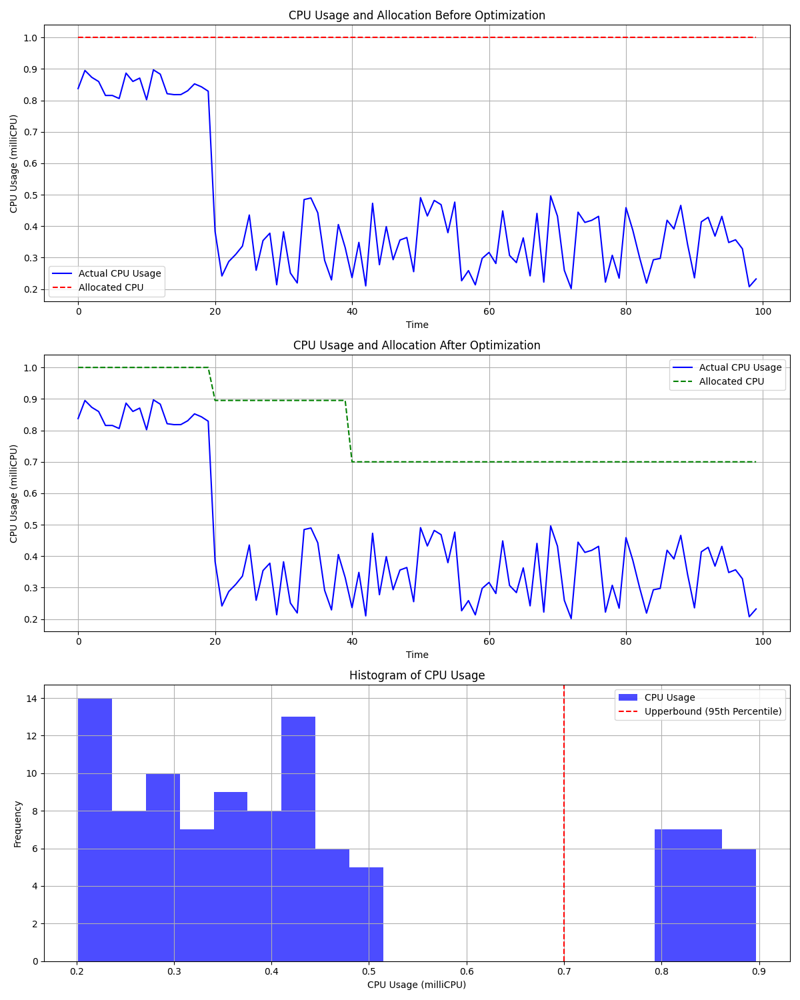

# graduation-project


<!-- PROJECT LOGO -->
<br />
<div align="center">
  <a href="https://github.com/dusdjhyeon/graduation-project">
    <h3 align="center">HPC(esp, ADAS Simulation) Workloads on Kubernetes</h3>
  </a>
</div>


<!-- ABOUT THE PROJECT -->
## :mag: About The Project
해당 프로젝트는 Advanced Driver Assistance System(ADAS) 시뮬레이션을 위한 클라우드 환경을 일반적인 고성능 컴퓨팅과 Job Schedule을 이용한 방식이 아닌 Kubernetes 환경에서 진행하기 위한 인프라 아키텍처 설계 연구입니다. 
GCP 환경에서 Argo Workflow로 HPC Workload 배포시 유연한 적응을 위한 환경을 Kubernetes를 이용해 구축합니다. 

> 해당 Repository는 실제 환경 구축에 사용했던 코드 중 중요 코드를 일부 옮겨 놓은 것으로 repo만으로 배포가 불가능 하며, 실제 코드와 차이가 있을 수 있습니다. 

### :card_file_box: Built With
#### :bulb: Language
[![Python][Python]][Python-url]
#### :bulb: Infrastructure
[![gcp][gcp]][gcp-url]
#### :bulb: Environment
[![Helm][Helm]][Helm-url]
[![github-actions][github-actions]][github-actions]
[![Terraform][Terraform]][Terraform-url]
[![Crossplane][Crossplane]][Crossplane-url]
[![Kubernetes][Kubernetes]][Kubernetes-url]
[![Argo-workflow][Argo-workflow]][Argo-workflow-url]

<p align="right">(<a href="#readme-top">back to top</a>)</p>
<br>


## :deciduous_tree: Repository Structure

``` bash
.
├── Argo-Workflow               # ADAS Simulation Workload를 위한 Argo-Workflow 예제 코드 및 실제 연구용 임시 workload 코드가 들어있습니다.
│   ├── highway.yaml
│   ├── inclement_weather.yaml
│   ├── test.yaml
│   └── urban_centers.yaml
├── Crossplane                  # Main Cluster(w/Terraform)에서 Multi-Cluster 구축을 위한 Crossplane Cluster 코드입니다.
│   ├── bash
│   ├── highway.yaml
│   ├── inclement_weather.yaml
│   └── urban_centers.yaml
├── In-Cluster                  # Cluster 내부에서 사용하던 코드들을 저장하는 Directory입니다.
│   ├── cr.yaml
│   ├── crd.yaml
│   ├── cronjob.yaml
│   ├── operator-python        # Python operator 코드 및 Dockerfile에 대한 코드입니다.
│   └── prometheus             # prometheus 쿼리(PromQL)에 사용한 코드가 들어 있습니다.
├── LICENSE
├── README.md
├── Terraform                 # GKE 간헐적 구동을 위한 GKE Terraform 코드입니다.
│   ├── main.tf
│   ├── module-gke
│   ├── module-network
│   └── variables.tf
└── images
    ├── cpu-optimize.png
    ├── dag-spot.png
    ├── full-arch.png
    └── k8s-arch.png
```

<p align="right">(<a href="#readme-top">back to top</a>)</p>
<br>


## :globe_with_meridians: Architecture
### :triangular_flag_on_post: Overall Simulation Architecture


- ADAS 시뮬레이션을 위한 전체적인 아키텍처 설계입니다.
<br>


### :triangular_flag_on_post: Kubernetes Advanced Architecture


- GKE의 Autopilot을 사용하지 않을 때 해당 서비스가 제공하는 기능들을 대신하기 위해 직접 구축한 프로세스들로, hpa 사용시 vpa를 동시에 사용하지 [못한다는 점](https://github.com/kubernetes/autoscaler/blob/master/vertical-pod-autoscaler/README.md#known-limitations)을 고려해 개발한 부분입니다. 
- 해당 프로세스는 [Source](./In-Cluster/)에서 확인 가능하며, operator의 경우 [Helm 차트](https://github.com/dusdjhyeon/graduation-as-helm)로 배포됩니다. 
- 각 자율주행 환경별로 다른 Cluster에서 Simulation을 실행하도록 해 Multi-Cluster 환경을 구성합니다.
- Main Cluster에서 각 Cluster를 Crossplane으로 배포하고, 각 Prometheus 메트릭을 수집하는 Prometheus를 둡니다.
- Main Cluster의 Prometheus의 메트릭을 쿼리해 장기간 실행 라벨이 붙은 워크로드에 대해서 매일 새벽 2시 자동으로 각 pod에 적합하도록 workload spec을 변경하도록 합니다.
- CPU의 Upper Bound에 맞춰 python operator가 workflow template을 자동으로 변경해줍니다.

#### Change to appropriate pod resource usage by operator

Workload따라 달라질 수 있으나 Sample 이미지에서는 다음과 같은 결과:
- 최적화된 CPU 할당량의 평균값: 0.701
- CPU 절약량: 0.230
- 절약된 CPU 자원의 백분율: 29.988%
<br>

### :triangular_flag_on_post: Detailed Logic


- DAG 수행중 일부 워크로드의 경우 spot vm에서 실행 가능하도록 해 비용 및 노드 리소스를 절감할 수 있습니다. 

<p align="right">(<a href="#readme-top">back to top</a>)</p>
<br>

<!-- LICENSE -->
## :closed_lock_with_key: License
Please refer to `LICENSE.txt` for LICENSE.
<p align="right">(<a href="#readme-top">back to top</a>)</p>


<!-- CONTACT -->
## :speech_balloon: Contact

<table>
  <tbody>
    <tr>
      <td align="center"><a href="https://github.com/dusdjhyeon"><br /><sub><b>Dahyeon Kang</b></sub></a></td>
    </tr>
  </tbody>
</table>

<p align="right">(<a href="#readme-top">back to top</a>)</p>


<!-- MARKDOWN LINKS & IMAGES -->
<!-- https://www.markdownguide.org/basic-syntax/#reference-style-links -->
[license-shield]: https://img.shields.io/github/license/dusdjhyeon/graduation-project.svg?style=flat
[license-url]: https://github.com/dusdjhyeon/graduation-project/blob/master/LICENSE.txt

[Python]: https://img.shields.io/badge/Python-3776AB?style=flat&logo=Python&logoColor=white
[Python-url]: https://www.python.org/
[gcp]: https://img.shields.io/badge/GCP-4285F4?style=flat&logo=GoogleCloud&logoColor=white
[gcp-url]: https://console.cloud.google.com/
[Helm]: https://img.shields.io/badge/Helm-0F1689?style=flat&logo=Helm&logoColor=white
[Helm-url]: https://helm.sh/
[github-actions]: https://img.shields.io/badge/GitHub_Actions-2088FF?style=flat&logo=github-actions&logoColor=white
[github-actions-url]: https://github.com/features/actions
[Terraform]: https://img.shields.io/badge/Terraform-844FBA?style=flat&logo=Terraform&logoColor=white
[Terraform-url]: https://www.terraform.io/
[Crossplane]: https://img.shields.io/badge/Crossplane-fff5b1?style=flat&logo=Crossplane&logoColor=white
[Crossplane-url]: https://www.crossplane.io/
[Kubernetes]: https://img.shields.io/badge/Kubernetes-326CE5?style=flat&logo=Kubernetes&logoColor=white
[Kubernetes-url]: https://kubernetes.io/
[Argo-workflow]: https://img.shields.io/badge/Argo_Workflows-EF7B4D?style=flat&logo=Argo&logoColor=white
[Argo-workflow-url]: https://argoproj.github.io/workflows/
